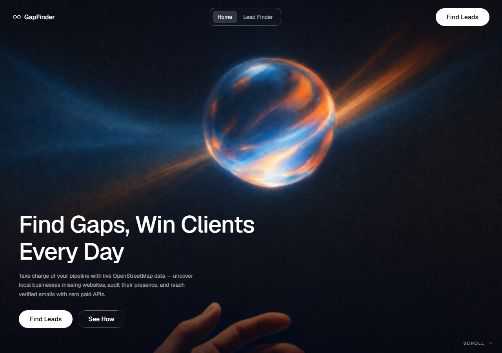
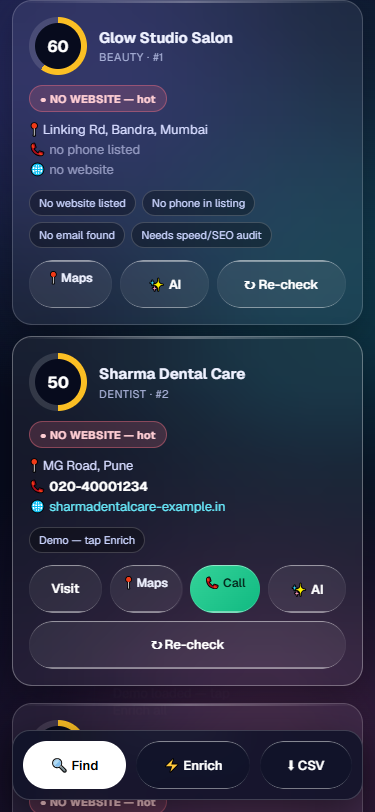
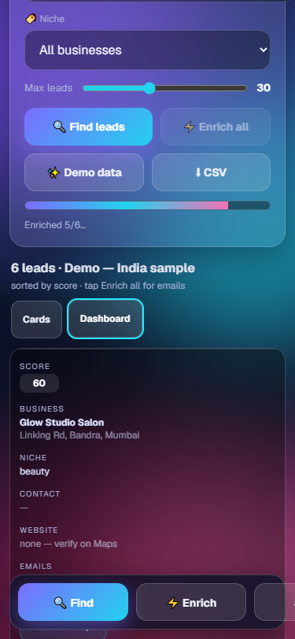

# ◈ GapFinder — Local Business Lead Engine

Find local businesses that desperately need a website. Live OpenStreetMap data →
website guessing → email crawling → free MX verification → hot-lead scoring.
**$0 in paid APIs.** Runs on your machine, mobile-friendly, with an animated
liquid-glass hero on top.




> Built for agencies & freelancers who sell websites, SEO, and online-presence
> services to local SMBs (salons, clinics, gyms, restaurants, hotels…).

---

## Table of contents

- [Features](#features)
- [How it works](#how-it-works)
- [Install](#install)
- [Host locally](#host-locally)
- [Test on your phone](#test-on-your-phone)
- [Configuration](#configuration)
- [AI Enrich (optional)](#ai-enrich-optional)
- [API reference](#api-reference)
- [Project structure](#project-structure)
- [Scope](#scope)
- [Costs](#costs)
- [Legal & responsible use](#legal--responsible-use)
- [Roadmap](#roadmap)
- [License](#license)

---

## Features

| Area | What you get |
|---|---|
| 🛰️ **Discovery** | Search any locality + niche → live businesses from OpenStreetMap Overpass API (3 mirrors with automatic fallback) |
| 🔍 **Enrich** | Auto-guesses missing websites (DuckDuckGo), crawls contact pages (de-obfuscates `[at]`/`[dot]`), classifies `no-website / dead-site / thin-site / has-website` |
| ✉️ **Verify free** | Syntax + DNS MX/A checks via `dnspython`, role-address fallback (`info@`, `contact@`, `hello@`) |
| ✨ **AI Enrich** | Optional ScrapeGraphAI layer for hot leads: official-site search + structured profile (owner, services, booking, pricing, socials). Free pipeline stays the default |
| 📝 **AI Summary** | Per-lead button (cards + dashboard) opening an AI business brief: what it does, fact bullets, contact — bottom-sheet modal on mobile |
| 📊 **Dashboard** | Cards ⇄ sortable table (score, niche, website, emails, source). Stacked-row layout on phones — no sideways scrolling |
| 📍 **Verify on Maps** | Every lead has a **Check Maps** button (Google Maps search for that exact business) to confirm it truly has no website |
| 📞 **Tap-to-call** | `tel:` call buttons wherever a phone exists — opens the dialer directly on mobile |
| ⬇️ **CSV export** | One-click export (name, category, address, phone, website, emails, MX, score, engine, reasons) |
| 📱 **Mobile-first** | 44–48px touch targets, bottom action bar, safe-area support, no iOS input zoom, liquid-glass UI |



---

## How it works

```
Area + niche
   │  Nominatim (geocode → bbox)
   ▼
Overpass API ──► leads (name, category, address, phone, website?)
   │  DuckDuckGo guess (if no site) → crawl /contact /about → regex emails
   ▼
DNS MX verify ──► 0–100 score + reasons ──► cards / dashboard / CSV
   │  optional: ✨ AI Enrich on hot leads (ScrapeGraphAI cloud)
```

Scoring: no website **+35**, dead site **+25**, thin site **+15**, no phone/email
**+10** each. Higher = hotter agency lead.

---

## Install

**Requirements:** Python 3.10+ · `pip` · internet access. No Docker, no API keys.

Windows (PowerShell):

```powershell
git clone https://github.com/0xjesu/gapfinder.git
cd gapfinder
pip install -r requirements.txt
python app.py
```

macOS / Linux:

```bash
git clone https://github.com/0xjesu/gapfinder.git
cd gapfinder
pip3 install -r requirements.txt
python3 app.py
```

Dependencies (`requirements.txt`): `flask`, `requests`, `beautifulsoup4`,
`dnspython`, `lxml` — all free, all open.

---

## Host locally

```powershell
python app.py
# → http://127.0.0.1:5000
```

That's it — Flask serves the UI + API on your machine. Your searches never
leave your computer except for calls to free public services (OSM, DuckDuckGo,
target websites, DNS).

| Env var | Default | Purpose |
|---|---|---|
| `HOST` | `127.0.0.1` | Bind address (`0.0.0.0` = reachable on your LAN) |
| `PORT` | `5000` | Port |
| `SGAI_API_KEY` | *(unset)* | Enables ✨ engine ScrapeGraph (optional) |
| `NVIDIA_API_KEY` | *(unset)* | Enables ✨ engine NVIDIA (optional) |
| `NVIDIA_MODEL` | `openai/gpt-oss-20b` | NIM chat model for extraction |

See [.env.example](.env.example). Never commit real keys (`.env` is git-ignored).

Examples:

```powershell
$env:PORT="8000"; python app.py          # custom port
$env:HOST="0.0.0.0"; python app.py       # LAN-visible (phone testing)
```

---

## Test on your phone

`localhost` never reaches a phone, so expose the laptop on your Wi-Fi:

1. Run with `$env:HOST="0.0.0.0"; python app.py`
2. Find your laptop IP (`ipconfig` → IPv4, e.g. `192.168.29.60`)
3. On your phone (same Wi-Fi): `http://192.168.29.60:5000`

If the page won't load, allow Python through Windows Firewall (admin PowerShell):

```powershell
New-NetFirewallRule -DisplayName "GapFinder" -Direction Inbound `
  -Program "C:\Users\<you>\AppData\Local\Programs\Python\Python313\python.exe" `
  -Action Allow -Profile Private
```

Call buttons open the phone dialer directly — that's where they shine.

---

## Configuration

Copy-paste tunables live in `app.py`:

- `OVERPASS_MIRRORS` — tried in order when one is busy
- Search bbox `d = 0.02` (~2 km each side; keeps Overpass fast)
- `score_lead()` weights (35/25/15/10, capped at 100)
- Demo data in `/api/demo` (offline-safe sample leads)

---

## AI Enrich (optional)

`sgai.py` + `nvidia.py` add a hybrid AI layer. Default stays 100% free; AI fires
only when you tap ✨ on a hot lead, using the engine picked in the
**✨ AI engine** dropdown (ScrapeGraph | NVIDIA).

**ScrapeGraphAI cloud** — fetches the page itself and extracts (~5 credits +
~6 for site search):

1. Get a free key at [scrapegraphai.com/dashboard](https://scrapegraphai.com/dashboard)
   (500 one-time credits ≈ ~45 hot leads)
2. `setx SGAI_API_KEY "sgai-..."` and restart `python app.py`

**NVIDIA NIM ([build.nvidia.com](https://build.nvidia.com))** — we fetch the
page text, your chosen model extracts strict JSON (OpenAI-compatible
`POST /v1/chat/completions`, temperature 0, JSON mode with plain-prompt retry):

1. Generate a key at build.nvidia.com (per-model entitlements differ per key —
   verify yours via `GET /v1/models`; `openai/gpt-oss-20b` is a safe default,
   also seen working: `moonshotai/kimi-k3`, `z-ai/glm-5.3-flash`)
2. `setx NVIDIA_API_KEY "nvapi-..."` (+ optional `setx NVIDIA_MODEL "..."`)
   and restart `python app.py`

The header pill shows `● AI on` / `● NV on` when keyed. Keys live **only** in
server-side env vars — never in browser code, never committed. On 401/402/429
the endpoint returns `engine: "free-fallback"` and the UI tells you.

---

## API reference

Base: `http://127.0.0.1:5000`

| Method & path | Purpose |
|---|---|
| `GET /` | UI (hero + tool) |
| `GET /api/health` | `{ok, dns, sgai:{enabled}, time}` |
| `GET /api/geocode?q=` | Place → bbox + lat/lon (Nominatim) |
| `POST /api/search` | `{area\|bbox, category, max}` → leads |
| `POST /api/enrich` | `{name, area, website, phone}` → emails, MX, score |
| `POST /api/ai-enrich` | Same, via AI (`engine: "sgai"` default \| `"nvidia"`) → `ai` / `ai-nvidia` / `free-fallback` / `disabled` |
| `POST /api/summary` | AI brief for one lead (`engine` optional) → `summary`, `bullets[]`, `contact`, `services[]` |
| `GET /api/demo` | 6 sample leads (works offline) |

---

## Project structure

```
gapfinder/
├── app.py              # Flask backend: OSM + crawl + MX + scoring + API
├── sgai.py             # Optional ScrapeGraphAI hybrid layer (needs key)
├── nvidia.py           # Optional NVIDIA NIM hybrid layer (needs key)
├── .env.example        # Safe template for keys/ports (copy to .env)
├── requirements.txt
├── templates/
│   └── index.html      # Liquid-glass hero + tool UI (single file, mobile-first)
├── hero/               # Standalone React + TS + Vite + Tailwind hero source
│   ├── src/App.tsx
│   ├── src/index.css   # .liquid-glass spec
│   └── package.json    # npm install; npm run dev
└── assets/             # README screenshots
```

Prefer the React hero standalone? `cd hero && npm install && npm run dev`.

---

## Scope

**In scope**

- Local-SMB lead discovery via free, keyless public data (OSM/Overpass/Nominatim)
- Website-gap detection, contact crawling, $0 email verification, lead scoring
- Agency workflow: dashboard → Maps-verify → call → CSV outreach
- Optional, clearly-marked AI upgrade path that degrades gracefully

**Out of scope / limitations**

- Not an Apollo/ZoomInfo/Clay replacement — no 200M-contact DB, no waterfall
  enrichment, no intent data. Those need paid APIs by nature.
- OSM coverage varies by region; tags (`phone`/`website`) are patchy outside
  well-mapped cities.
- Free MX checks can't resolve catch-all domains (20–40% of B2B inboxes) or
  Gmail/Yahoo decision-makers — treat `role@` guesses as leads, not guarantees.
- Enrichment is deliberately polite (timeouts, delays) — bulk runs take minutes.
- No auth/multi-user: it's a local single-user tool. Don't expose it to the
  public internet without adding authentication and rate-limiting.
- A previous Google-Maps-scraper integration was removed (needs Docker, legally
  grey, flaky) — the **Check Maps** verify links cover the verification need.

---

## Costs

| Mode | Cost |
|---|---|
| Default pipeline (OSM + crawl + MX) | **$0 forever**, no keys |
| ✨ AI Enrich (ScrapeGraph) | $0 on the 500-credit free tier, then from $20/mo (your key, your spend) |
| ✨ AI Enrich (NVIDIA) | Billed on your build.nvidia.com account (your key, your spend) |
| Hosting | $0 locally · ~$5/mo VPS if you outgrow localhost |

---

## Legal & responsible use

- OSM data is © OpenStreetMap contributors, ODbL (attribution shown in-app).
- Respect `robots.txt`, rate limits, and terms of target sites when crawling.
- Scraped phones/emails are personal data: follow GDPR / CCPA / CAN-SPAM
  (consent or documented legitimate interest, opt-outs, no spam).

---

## Roadmap

- [ ] Playwright-backed crawl for JS-heavy sites (optional, local)
- [ ] Lighthouse batch audit per lead (performance/SEO scores in dashboard)
- [ ] `Dockerfile` + rate-limiting for safe VPS deployment
- [ ] Saved searches + lead revisit/notes (SQLite)

---

## License

MIT — see [LICENSE](LICENSE).
